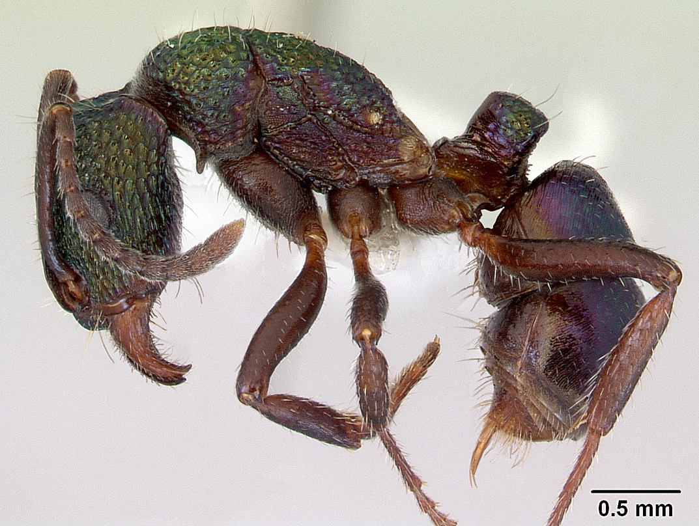

# Cleaned Up Project Repository

## Contents
- Data
- Source Code

### Data
- Survey Data
- Images
	1. Rhytidoponera metallica: 
	2. Camponotus darwinii: 
	3. Acanthomyrmex ferox:
	4. Cataglyphis fortis:
### Source Code
- [Get Dataset](messy-project-directory/source-code/get-dataset.py)
- [Get Species List](messy-project-directory/source-code/get-species-list.py)
- [Predict Image](messy-project-directory/source-code/predict-image.py)
- [Main](messy-project-directory/source-code/main.py)

Download the course files with the following link: [github.com/fredhutchio/tfcb_2019/archive/master.zip](https://github.com/fredhutchio/tfcb_2019/archive/master.zip). Copy the contents of `messy-project-directory/` to a new directory on your computer named `tfcb-homework01`.

